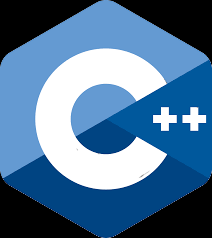
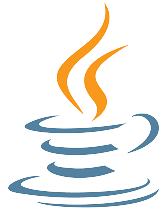
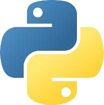
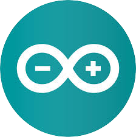

Welcome to my GitHub 
=======
- I write **C++** and **Java** with the occasional dip into **Python**.
- I have an interest in **Cyber Security** which I am currently studying.
- I am currently working on controlling my robot arm and rover using ESP32S and **ESP-NOW** 
- You can reach me on **LinkedIn**

  
  
  
  
  
  

 

<!--
**UNIJackS/UNIJackS** is a ✨ _special_ ✨ repository because its `README.md` (this file) appears on your GitHub profile.

Here are some ideas to get you started:

- 🔭 I’m currently working on ...
- 🌱 I’m currently learning ...
- 👯 I’m looking to collaborate on ...
- 🤔 I’m looking for help with ...
- 💬 Ask me about ...
- 📫 How to reach me: ...
- 😄 Pronouns: ...
- ⚡ Fun fact: ...
-->
